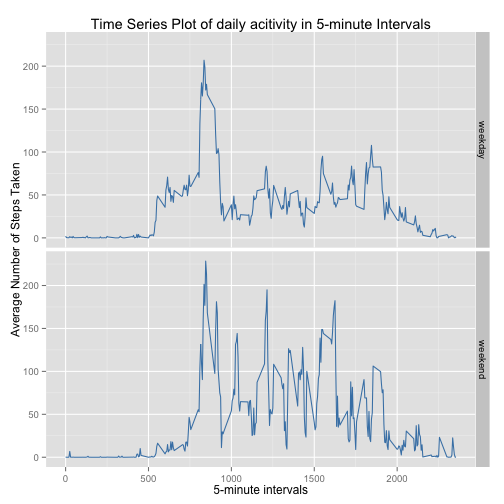

Loading in the libraries:

```r
library(ggplot2)
library(dplyr)
library(lubridate)
```

## Loading and preprocessing the data

##### 1. Load the data
Unzipping and reading the data into a dataframe.

```r
if(!file.exists('activity.csv')){
    unzip('activity.zip')
}
data <- tbl_df(read.csv("activity.csv", na.strings = c(".", "", "?", "NA"), strip.white = TRUE))
```

##### 2. Transforming the data
The dates were read in as a factors, they need to be transformed
into a date format.


```r
data <- data %>%
        mutate_each(funs(ymd(.)), date)
```


## What is mean total number of steps taken per day?
Using dplyr to clean and concentrate the dataframe before calculating the mean.


```r
stepsmean <- data %>%
        select(steps, date) %>% # subset on the variables of interest
        filter(!is.na(steps), !is.na(date)) %>% # omit NA:s
        group_by(date) %>% # group by date
        summarise(stepsum = sum(steps)) %>% # sum steps for each date
        summarise(meandailysteps = mean(stepsum)) # calculate mean of daily steps
stepsmean[[1]]
```

```
## [1] 10766.19
```

##### 1. Histogram of the total number of steps taken each day
Preparing the data using part of the code from the calculation above and
showing the first rows.


```r
dfstepsday <- data %>%
        select(steps, date) %>% # subset on the variables of interest
        filter(!is.na(steps), !is.na(date)) %>% # omit NA:s
        group_by(date) %>% # group by date
        summarise(stepsum = sum(steps)) # sum steps for each date
        
head(dfstepsday, n = 3) # showing the first rows
```

```
## Source: local data frame [3 x 2]
## 
##         date stepsum
## 1 2012-10-02     126
## 2 2012-10-03   11352
## 3 2012-10-04   12116
```

Preparing the histogram using ggplot.


```r
p <- ggplot(data = dfstepsday, aes(stepsum)) + # defining data
        geom_histogram(colour="black", fill="#DD8888") + # specifying histogram
        xlab("Number of daily steps") + ylab("Frequency") + # setting labels
        ggtitle("Distribution of steps per day") # setting title
p
```

```
## stat_bin: binwidth defaulted to range/30. Use 'binwidth = x' to adjust this.
```

 

##### 2. Mean and median total number of steps taken per day

```r
dailystepsmean <- dfstepsday %>%
        summarise(mean = mean(stepsum))

dailystepsmedian <- dfstepsday %>%
        summarise(median = median(stepsum))
```
* Mean: 1.0766189 &times; 10<sup>4</sup>
* Median:  10765


## What is the average daily activity pattern?

##### 1. Making a time series line plot
Prepare the data with the x-axis as the five minute slots and the y-axis the
average number of steps per day, averaged over all days.


```r
dfactivity <- data %>%
        select(steps, interval) %>% # select variables of interest
        filter(!is.na(steps), !is.na(interval)) %>% # omit NA:s
        group_by(interval) %>% # group on the timeslot number
        summarise(stepsavg = mean(steps)) # calculate the average per slot number
```


```r
ptimeseries <- ggplot(data = dfactivity, aes(x = interval, y = stepsavg)) +
        geom_line(color = "steelblue", size = 0.5) + 
        ggtitle("Time Series Plot of daily acitivity in 5-minute Intervals") + 
        xlab("5-minute intervals") + ylab("Average Number of Steps Taken")
ptimeseries
```

 

##### 2. Calculating the maximum number of steps


```r
maxstepstimeslot <- dfactivity %>%
        filter(stepsavg == max(stepsavg))
maxstepstimeslot[[1,1]]
```

```
## [1] 835
```
The timeslot with maximum number of steps has the label 835.


## Imputing missing values

##### 1. Calculate and report the total number of missing values in the dataset


```r
missingnr <- sum(is.na(data))
```
There is a total of 2304 missing values in the dataset.

##### 2. A strategy for filling in all of the missing values in the dataset

The choosen strategy is to fill in each missing data with the mean value for 
the respective five minute timeslot.

##### 3. A new dataset that is equal to the original dataset but with the missing data filled in
We create a new dataset without na:s, as follows.

```r
datawithoutna <- data %>% 
        mutate(steps = as.numeric(steps)) %>% # change integer to numeric
        group_by(interval) %>% # prepare for the calculation of the mean
        mutate(steps = ifelse(is.na(steps), mean(steps, na.rm = TRUE), steps)) # fill in data
head(datawithoutna, n = 3)        
```

```
## Source: local data frame [3 x 3]
## Groups: interval
## 
##       steps       date interval
## 1 1.7169811 2012-10-01        0
## 2 0.3396226 2012-10-01        5
## 3 0.1320755 2012-10-01       10
```

##### 4. A histogram of the total number of steps taken each day

Prepare the dataframe for total number of steps taken each day, using the new
dataset without na:s.


```r
dfstepsdaynonas <- datawithoutna %>%
        select(steps, date) %>% # subset on the variables of interest
        group_by(date) %>% # group by date
        summarise(stepsum = sum(steps)) # sum steps for each date
head(dfstepsdaynonas, n = 3)
```

```
## Source: local data frame [3 x 2]
## 
##         date  stepsum
## 1 2012-10-01 10766.19
## 2 2012-10-02   126.00
## 3 2012-10-03 11352.00
```

Preparing a histogram using the dataset 'dfstepsdaynonas'.


```r
p <- ggplot(data = dfstepsdaynonas, aes(stepsum)) + # defining data
        geom_histogram(colour="black", fill="#DD8888") + # specifying histogram
        xlab("Number of daily steps") + ylab("Frequency") + # setting labels
        ggtitle("Distribution of steps per day with NA:s replaced") # setting title
p
```

```
## stat_bin: binwidth defaulted to range/30. Use 'binwidth = x' to adjust this.
```

 

* Calculate and report the mean and median total number of steps taken per day

```r
dailystepsmeannonas <- dfstepsdaynonas %>%
        summarise(mean = mean(stepsum))

dailystepsmediannonas <- dfstepsdaynonas %>%
        summarise(median = median(stepsum))
```
*Mean without NAs: 1.0766189 &times; 10<sup>4</sup>*

*Median without NAs:  1.0766189 &times; 10<sup>4</sup>*

* These values differ somewhat from the estimates from the first part of the assignment


```r
diffmeans <- dailystepsmean[[1]] - dailystepsmeannonas[[1]]
diffmedians <- dailystepsmedian[[1]] - dailystepsmediannonas[[1]]
```

The difference in means is 0

The difference in m-1.1886792ffmedians`

* What is the impact of imputing missing data on the estimates of the total daily number of steps?

The means stay intact, when replacing the missing data with the means of every interval. The
medians differ, in this case with a little more than one step.


## Are there differences in activity patterns between weekdays and weekends?

The calculations will be performed using the dataset with filled in missing values.

##### 1. Create a new factor variable in the dataset with two levels <U+2013> <U+201C>weekday<U+201D> and <U+201C>weekend<U+201D>

Prepare the new dataset.


```r
dfstepsdaynonasweekend <- datawithoutna %>%
        mutate(datetype = wday(date, label = TRUE)) %>% # identify weedays
        mutate(datetype = ifelse(datetype == c("Sat", "Sun"), "weekend", "weekday")) %>%
        group_by(datetype, interval) %>% # group by datetype and interval
        summarise(stepavg = mean(steps)) # calculate average steps per interval
head(dfstepsdaynonasweekend, n = 3) # show first rows of dataset
```

```
## Source: local data frame [3 x 3]
## Groups: datetype
## 
##   datetype interval   stepavg
## 1  weekday        0 1.9437522
## 2  weekday        5 0.3844785
## 3  weekday       10 0.1495194
```

```r
tail(dfstepsdaynonasweekend, n = 3) # show last rows of dataset
```

```
## Source: local data frame [3 x 3]
## Groups: datetype
## 
##   datetype interval    stepavg
## 1  weekend     2345 3.33018868
## 2  weekend     2350 0.02830189
## 3  weekend     2355 0.13443396
```

##### 2. A panel plot containing a time series plot of the 5-minute interval (x-axis) and the average number of steps taken

Plot the data from the new dataset.


```r
ptimeseriesdatetype <- ggplot(data = dfstepsdaynonasweekend, aes(x = interval, y = stepavg)) +
        geom_line(color = "steelblue", size = 0.5) + 
        facet_grid(datetype ~ .) +
        ggtitle("Time Series Plot of daily acitivity in 5-minute Intervals") + 
        xlab("5-minute intervals") + ylab("Average Number of Steps Taken")
ptimeseriesdatetype
```

 

Thank you for your peer assessment of my work!
/Johan
